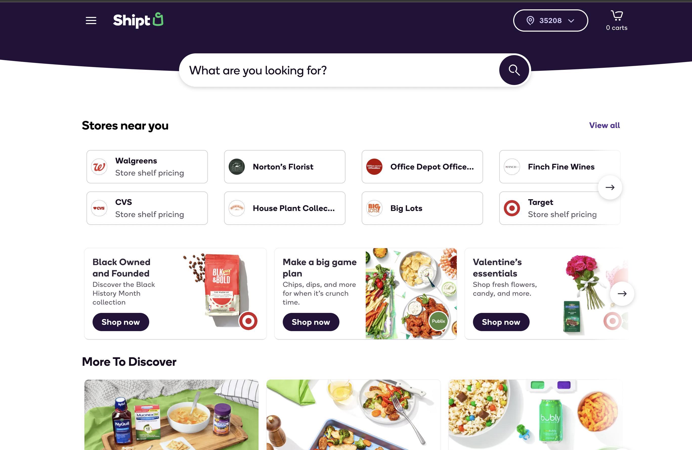

# Shipt-Webpage-Clone-using-terraform
Simple Shipt webpage clone using terraform.

  
  

# Realtime DevOps Project: Automated Static Website Hosting with Terraform and AWS Cloud
This project aims to demonstrate the automation of static website hosting using Terraform and AWS Cloud, providing with a comprehensive understanding of Terraform's concepts and its integration with AWS. By following this project, users will learn how to create a one-click automated solution for DevOps tasks, focusing on the specific example of cloning the Shipt webpage using Terraform.

# Project Overview
Objective: Set up static website hosting fully automated in just 3 seconds using Terraform and AWS Cloud.

Benefits:

Gain hands-on experience with Terraform and AWS.
Understand the principles of Infrastructure as Code (IaC).
Learn to automate DevOps tasks efficiently.

# Key Features
Terraform Integration: Explore the seamless integration of Terraform with AWS services.

Automated Deployment: Witness the power of one-click automated solutions for DevOps tasks.

# How to Use
Clone the Repository: Start by cloning this repository to your local machine.

bash
Copy code
git clone https://github.com/RitikRaut/shipt-webpage-clone-using-terraform.git
Install Terraform: If you haven't already, install Terraform on your system. Refer to the Terraform documentation for installation instructions.

Set Up AWS Credentials: Ensure you have AWS credentials set up on your machine with appropriate permissions for deploying resources.

Deploy the Infrastructure: Navigate to the cloned repository directory and run Terraform commands to deploy the infrastructure.

bash
Copy code
cd shipt-webpage-clone-using-terraform
terraform init
terraform apply
Access Your Website: Once the deployment is complete, access your static website hosted on AWS and explore the automated solution in action.
